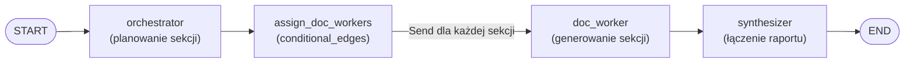
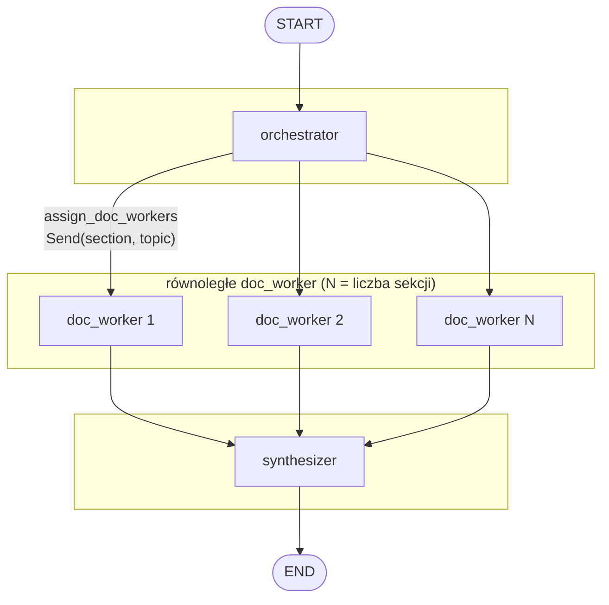

# Dokumentacja orchestratora

Dokument opisuje graf workflow z pliku `orchestrator.py` — pipeline generowania dokumentacji w oparciu o RAG (Retrieval-Augmented Generation).

---

## Diagram grafu

### Wersja z widocznym fan-out (równoległe worker-y)

---

## Opis węzłów

| Węzeł            | Opis |
|------------------|------|
| **orchestrator** | Planuje 3–5 sekcji dokumentacji (model ze structured output `Sections`). Wejście: `topic`. Aktualizuje stan: `sections`. |
| **assign_doc_workers** | Funkcja warunkowa (conditional edges). Dla każdej sekcji z `state["sections"]` zwraca `Send("doc_worker", {"section": s, "topic": state["topic"]})` — uruchamia N równoległych workerów. |
| **doc_worker**   | Dla jednej sekcji: pobiera kontekst z retrievera, generuje treść sekcji na podstawie kontekstu Docker. Zwraca `completed_sections` (lista 1-elementowa; reducer `operator.add` łączy wyniki z wszystkich workerów). |
| **synthesizer**  | Łączy `completed_sections` w jeden raport (`\n\n---\n\n`) i zapisuje w `final_report`. |

---

## Stan (OrchestratorState)

| Pole               | Typ                    | Opis |
|--------------------|------------------------|------|
| `topic`            | `str`                  | Temat dokumentacji (wejście użytkownika). |
| `sections`         | `list[Section]`        | Lista sekcji wygenerowana przez orchestrator (name, description). |
| `completed_sections` | `Annotated[list[str], operator.add]` | Fragmenty raportu zwracane przez workerów; reducer skleja listy. |
| `final_report`     | `str`                  | Końcowy raport po syntezie. |

---

## Przepływ sterowania

1. **START → orchestrator** — jedyna ścieżka wejścia.
2. **orchestrator → assign_doc_workers** — krawędź warunkowa; nie wybiera „gałęzi”, tylko zwraca listę `Send`, co rozgałęzia wykonywanie do wielu wywołań `doc_worker`.
3. **doc_worker → synthesizer** — każdy worker po zakończeniu idzie do synthesizera (zbieranie wyników).
4. **synthesizer → END** — koniec grafu.

---

## Zależności

- **LangGraph**: `StateGraph`, `START`, `END`, `Send`
- **Retriever**: `get_retriever()` z modułu `retriever`
- **LLM**: ChatOpenAI (OpenRouter, model `openai/gpt-4o`) z structured output dla planera i zwykłym invoke w workerze

Dokument wygenerowany na podstawie `orchestrator.py`.
